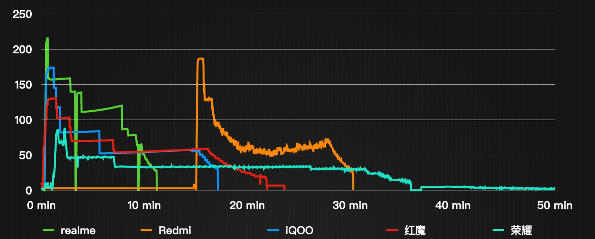

---

author:

	- EIR

title: 手机选购指南

date:  2025-08-24

---

::: tip

秉承着授人以鱼不如授人以渔的精神，本文将以简单易懂的文字介绍如何选购手机\

本文不包含任何理论知识，只要认识中国汉字，读完全文之后，你也能对手机各种参数有大致的了解与分辨能力\

若想了解现在优秀的手机，可前往各大视频平台搜索相关推荐视频\

本文将主要解决什么情况买手机，什么是好手机，怎样买手机好的问题\

:::

::: tip

该文章处于未完成的状态 需要更多人自愿分享他们的体验 希望大家踊跃编辑\

如有需要自主补充新内容的 请将内容添加至正文 标明作者（可匿名）谢谢喵

:::

::: warning

手机一年会进行一次大更新，迭代速度较快，故本文将不注重于直接推荐型号\

每个人的需求大不同，本文将推荐**各方面都无大问题、满足大多数人**的方案，若有个人的特殊需求，可自身进行网络上的进一步的学习\

本文章仅供参考，信息了解止于2025/08/24

:::

## 什么情况买手机

::: tip

大学里，生活和学习都离不开手机，若您**未拥有**一部自己的手机，请跳过本节，因为您一定需要买手机\

本章意在为您**省钱**，有时一些不存在的需求或消费主义会使人麻木，而有些问题又可通过比买新机更便宜的方法解决

:::

::: details

### 1、有闲钱

买手机，肯定是要钱，并且我们鼓励您将**预算固定在1000以内的区间**，如2000~3000，或更小的范围，这将为您之后的选购节省时间

### 2、机型过老

硬件老化是不可避免的\

以下若有一个条件符合，我们强烈建议您更换手机

- **电池老化：**若您对老手机的性能还算满意，只是一天需要多次充电，外出离不开充电宝，有**电量焦虑**时，可前往线下的官方店进行手机售后，更换电池，各大品牌换电池的价格将在100左右，这是更有性价比的方案（除苹果手机，该公司产品售后价格较高，不推荐仅更换手机）

- **性能落后：**若您有对**性能的需求**，如直播或大型游戏的游玩，而手中的手机不能很好的完成，我们鼓励您更换手机

- **屏幕上的细线、裂缝：**这是屏幕方面的损坏，若并不是新手机，并且影响您的使用时，我们鼓励您更换手机（屏幕售后价格或将高达千元）

  ---

::: warning

**觉得手机看着老，羡慕他人新手机：**若只是外观方面的意见，并不是充分的换机理由，只有外观层面的问题恰恰说明手机在作为一个工具的角度，它已经可以完成您需要的所有功能，我们将以**省钱的角度**劝您，您可通过换手机壳或手机膜的行为去对手机外观带来新的改变\

但若新手机新外观会给您带来确定的好处，我们依然鼓励您更换手机

:::

### 3、必要的功能

若您在生活中或学习中有了解到**必须的功能**是现有的手机**不具备**的，比如您的手机不支持5G，我们鼓励您更换手机，而若只是看到厂商宣传的新功能，且并不必须时，我们以**省钱的角度**劝诫您，请自行判断这是否是消费主义的陷阱，这些功能是否是必须的

### 4、存储空间不足

- **文件、照片多：**可先使用手机清理软件，或使用云备份，或备份在其他设备的操作去腾出空间

- **微信、QQ占用空间大：**可进入app后，点击**设置/通用/存储空间**，对文件进行清理与备份操作

  而若您有很多app、游戏需要使用且空间不足，或没有适合备份的设备，我们鼓励您更换手机

:::

## 什么是好手机

::: tip

本章将介绍主要的**手机参数**如何看，如何比较，手机的详细参数一般会在某宝、某东等**交易平台或手机官方网站**的页面中找到，可前往查看比较

*“没有不好的手机，只有不好的价格”*

*"适合自己的永远是最好的"*

:::

---

### 1、品牌

::: tip

我们仅推荐**大品牌的手机**，因为大品牌的手机线下售后维修点多，用户反馈多，是多数人的选择，买手机前，也可查询学校/家附近是否有维修店，以防万一

:::

品牌名单：**苹果、华为、小米（红米）、OPPO（realme/一加）、VIVO（IQOO）、荣耀**（括号内为这些品牌的子公司）

---

### 2、价格

::: tip

不同品牌型号，价格分布也不同，我们将简要为您描述不同价位的手机配置如何，仅作参考

:::

以下单位统一为人民币，价格为每种型号的**最低配价格**（截止于2025年）

- **0~2000：**主要为老人机，或性价比机，芯片水平较低，可满足日常操作，适合**预算一般**的用户购买

- **2000~4000：**主要为性能机，是**学生购买最多**的价位，主要集中在2500左右，部分手机会用上当年最好的芯片，这个价位的手机**性能是最强的**、适合**长时间游戏**的群体购买

- **4000~6000：**主要为旗舰机，手机各方面几乎无短板，摄像头有明显加强，每年都是各大公司的牌面，这个价位的手机**综合能力最强**，预算够的用户买这个价位的手机基本**不会出错**

- **6000+：**主要为苹果和华为这俩高端品牌的手机，若家中已有同品牌设备，或有品牌信仰、品牌需求，可考虑，若无特殊需求，可**降预算**购买其他品牌

**折叠机或其他概念机：**大多为实验或时尚品，若有特定需求可购买，这些手机质量与价格往往并不匹配，请三思而后行

***“去年的旗舰最有性价比”：***一般过了一年，前一年的旗舰或多或少都会降价

**二手平台：**质量说不准，需要做好被坑的准备

#### 价位品牌推荐（截止于2025年）：

::: details

- **0~3000：**建议购买红米、一加、realme、IQOO
- **3000~6000：**建议购买小米、OPPO、VIVO
- **6000+：**建议购买苹果、华为

:::

::: tip

有句古话说的好：*~~“两千万预算，五毛钱花完，剩多少你赚多少”~~  “勤俭节约是美德”*

:::

---

### 3、芯片

手机的性能如何很大程度上**取决于芯片**

排行榜：[手机/平板芯片综合性能排行](https://socpk.com/allperf/)

**截止25年**性能优秀/尚佳的旗舰芯片：（若您看参数看到**包含以下芯片**关键字的，皆可相信其性能）

- **高通：**骁龙8elite2、骁龙8elite、骁龙8gen、骁龙8gen2
- **联发科：**天玑9400+、天玑9400、天玑9300+、天玑9300
- **苹果：**iphone14及以上
- **小米部分机型：**玄界O1

::: warninng

华为为自研芯片，截止于2025年，其水平仍离世界顶尖芯片有一定差距，如您确有**性能要求**，我们不鼓励您购买任意一款华为品牌手机

:::

---

### 4、续航/充电

（**截止至24年**）：[续航排行榜](https://socpk.com/batlife/)

::: warning

排行榜为**极端环境**测试，若非高强度玩游戏或看直播，**意义不大，仅作参考**

:::

对于快充，厂家倾向于标定最大功率，而不会一直跑满\

如图：（图片取自[200W级手机快充对比！虚标？降速？发热严重？这里有你想要的答案](https://www.bilibili.com/video/BV1eg4y1376J/)）

充电**功率会随着电量的提升而下降**，因为充电时间久了，就会发热，这是厂商保护手机避免过热的方案

因此快充手机是**很值得购买**的，现在**除了苹果**，基本都有峰值在80瓦以上的快充了

*~~”快充消耗电池寿命，慢充消耗自己寿命“~~*

::: tip

苹果在电池和快充方面硬件一般，但其也有优秀的系统及调度，在一定程度上弥补了硬件的差距

:::

---

### 5、摄影

摄影是**极其需要性能**的，一般的手机拍照发朋友圈的问题不大，而**摄影镜头优秀**的手机价格普遍在4000+元

截止于2025年，若在参数表中看到**“潜望长焦”**，则其摄影水平是基本不会差的

若无摄影需求，我们鼓励您降低预算购买[性能机](#destination)

---

### 6*、玩机/Root

不鼓励拿主力机Root、可尝试旧手机，或购买二手的允许解BL锁的设备

## 怎样买手机好

- **确定预算：**早点确定预算，也是早点确定需求，这样又省时间又省钱
- **善用网络：**在某站可以多搜索[手机推荐](https://search.bilibili.com/all?keyword=手机推荐)的视频，货比三家
- **选购平台：**正版旗舰店不出问题，第三方平台可能会赚
- **购机时间：** *"早买早享受，晚买有折扣"* 